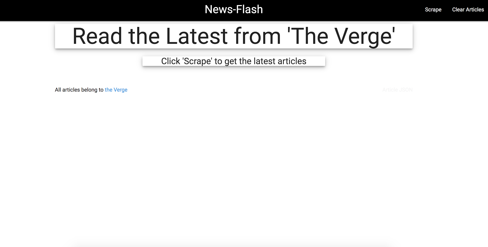
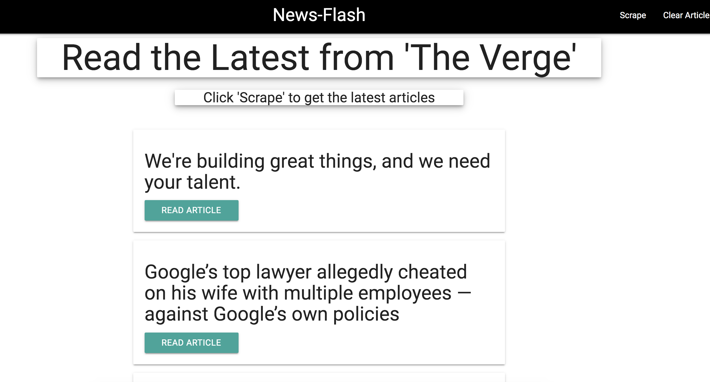
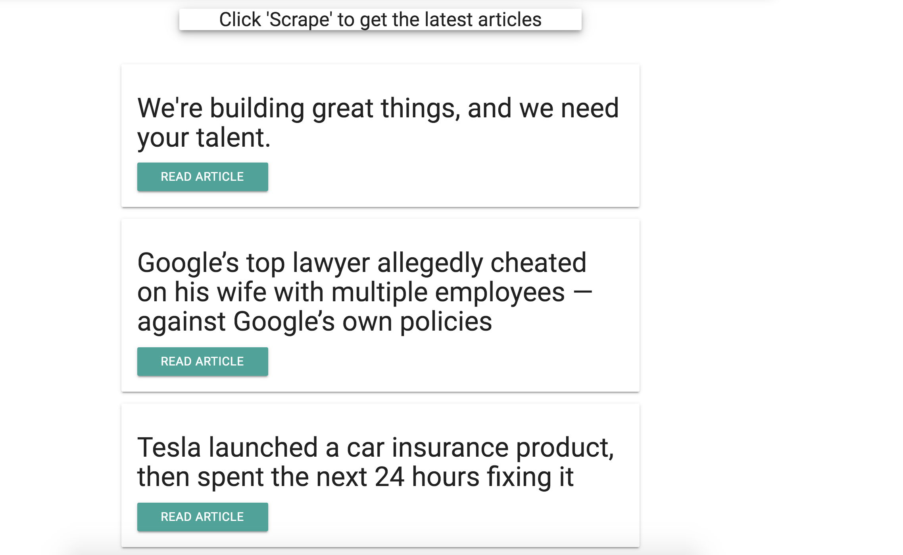
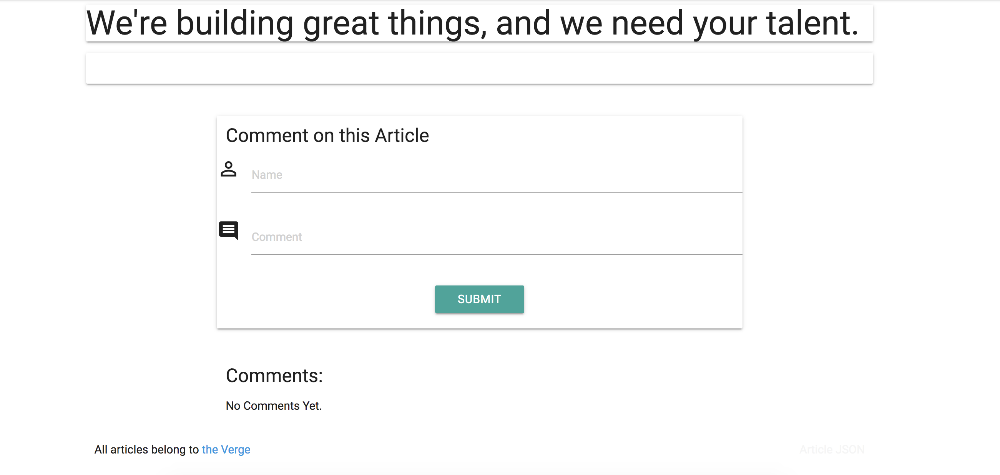
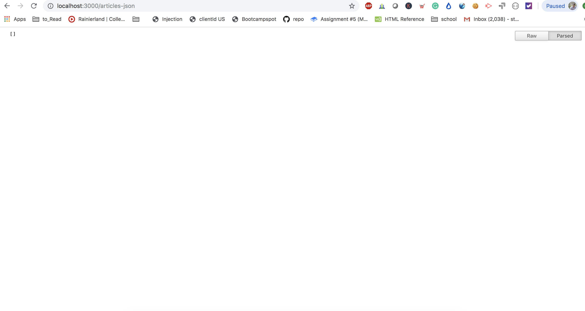

# News-Flash

## Overview

News-Flash scrapes the interent and displays the information. Using node, mongo, cheerio, handlebars.

### Step One

1) Running this application will first display the scraper home page

### Step Two

2) The user clicks on scrape and articles appear. Whenever a user visits my site, and clicks scrape, the news outlet (the verge) is scraped and it displays the article for the user. Each scraped article is saved to my application database.

### Step Three

3) User sees all of the following once scraper button is clicked:

Headline - the title of the article

Summary - a short summary of the article

URL - the url to the original article

### Step Four

Users is able to leave comments on the articles displayed and revisit them later. The comments is saved to the database as well and associated with their articles. Users are able to delete comments left on articles. All stored comments should be visible to every user.

### Step Five

Once the user clicks "clear Articles" in the navbar, it clears all the articles that were scraped returning an empty screen.

